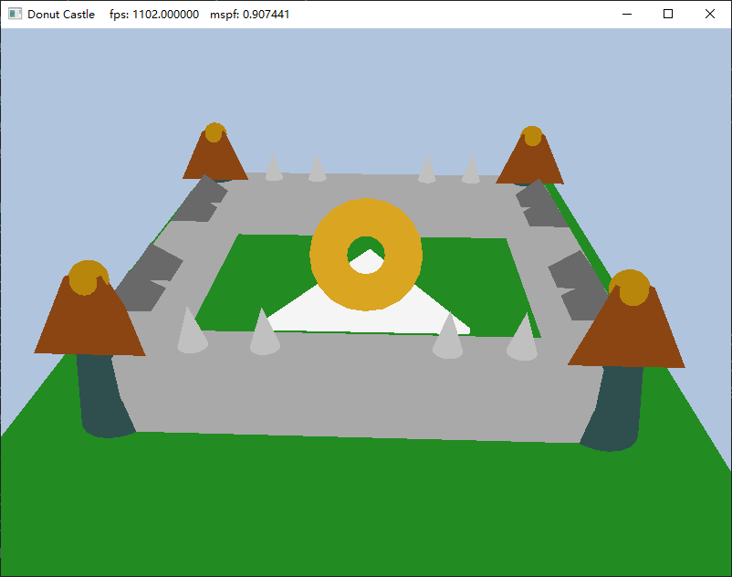

```C++
MeshData CreateCone(float bottomRadius, float height, uint32 sliceCount, uint32 stackCount);
MeshData CreatePyramid1(float bottomEdge, float height, uint32 numSubdivisions);
MeshData CreatePyramid2(float bottomEdge, float topEdge, float height, uint32 numSubdivisions);
MeshData CreateSquarePyramid(float bottomEdge, float height, uint32 numSubdivisions);
MeshData CreateTriangularPrism(float bottomEdge, float height, uint32 numSubdivisions);
MeshData CreateTorus(float torusRadius, float tubeRadius, uint32 sliceCount, uint32 stackCount);
```
